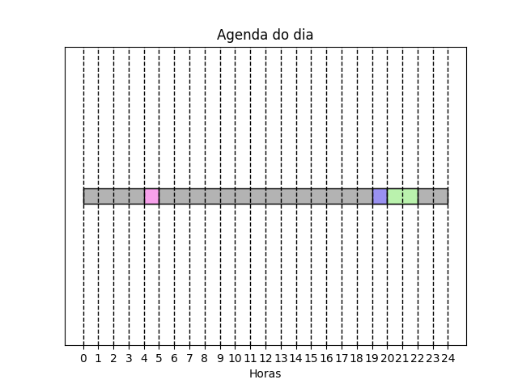

# Quanto Custa Uma Lavagem de Roupa na Lavanderia

## Alunos

| Matrícula  | Aluno                            |
| ---------- | -------------------------------- |
| 18/0054082 | Marcelo Victor de Sousa Silva    |
| 18/0029223 | Washington Bispo Arishita Junior |

## Sobre 

Esse projeto tem como objetivo simular um sistema de gestão de roupas em uma lavanderia, mostrando qual a forma mais eficiente de realizar o processo de lavagem através do algoritimo "time scheduling" 

## Screenshots




## Instalação 
**Linguagem**: C#, Python<br>
**Framework**: .Net Core, Fast API<br>

Para rodar o projeto é necessário os seguintes requisitos.

- Docker
- Visual Studio
- Python 3
- PIP
- Fast API

## Uso 

Para rodar a aplicação primeiramente abra o projeto na pasta

```
./Banco/Lavanderia
```

seguido disso defina a solução do docker como "projeto de inicialização"

e em seguida execute o docker compose.

após isso irá abrir uma aba no seu navegador padrão com o swager.

a partir da aba você irá conseguir popular a aplicação além de baixar o mapa que foi gerado a partir do algoritimo do time scheduling, sendo mostrado no vídeo de apresentação.

A API do FastAPI foi realizada deploy para facilitar o uso, sendo encontrado:

<https://o6j48p.deta.dev/docs#/Agenda/plotar_Agenda__post>

também podendo ser rodado através do console.

Para instalar as depêndencias rode o seguinte comando dentro da pasta: 

```
./FastAPI

pip install -r requirements.txt
```

Seguido a isso execute o Fast API através do seguinte comando

```
uvicorn main:app --reload
```

## Apresentação

O link da apresentação pode ser encontrado no seguinte link:

<https://youtu.be/bXqJki8syqw>

e também na pasta raiz com o nome:

```
./apresentacao.mp4
```
